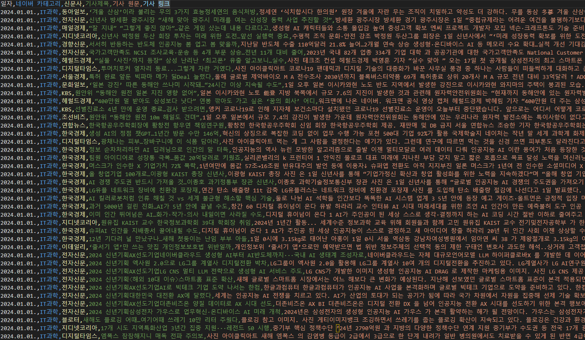

# NewsCrawler(개발 중)

## Reference
해당 크롤러는 [KoreaNewsCrawler](https://github.com/lumyjuwon/KoreaNewsCrawler)를 기반으로 사용 목적에 맞게 재구성하였습니다.
변경한 계기는 다음과 같습니다.  
  1. 실행 결과 생성되는 .csv 파일 출력을 원하는 데이터프레임 형태로 바꾸기 위해.
  2. 크롤링 Delay가 너무 짧을 경우 연결이 끊어지는 상황 발생
  3. 코드 상에서 설정된 인코딩 방식에 따라 뉴스 크롤링 과정에서 문자 깨짐 현상이 발생.
  4. 뉴스 별 제목 설정 형식이 달라서 코드를 수정할 필요를 느낌.


## 네이버 뉴스의 각 토픽별 대응번호
해당 크롤러애는 다음과 같은 카테고리 뉴스를 크롤링 할 수 있습니다.
|토픽(카테고리)|번호|
|:-----------:|:--:|
|정치(politics)|100|
|경제(economy)|101|
|사회(society)|102|
|생활문화(living_culture)|103|
|세계(world)|104|
|IT과학(IT_science)|105|
|오피니언(opinion)|110|
  
## How to install
    pip install 미정
    
## Method

* **set_category(category_name)**
  
 이 메서드는 수집하려고자 하는 카테고리는 설정하는 메서드입니다.  
 파라미터에 들어갈 수 있는 카테고리는 '정치', '경제', '사회', '생활문화', 'IT과학', '세계', '오피니언'입니다.  
 파라미터는 여러 개 들어갈 수 있습니다.  
 category_name: 정치, 경제, 사회, 생활문화, IT과학, 세계, 오피니언 or politics, economy, society, living_culture, IT_science, world, opinion
  
* **set_date_range(startyear, startmonth, endyear, endmonth)**
  
 이 메서드는 수집하려고자 하는 뉴스의 기간을 의미합니다. 기본적으로 startmonth월부터 endmonth월까지 데이터를 수집합니다.
  
* **start()**
  
 이 메서드는 크롤링 실행 메서드입니다.
  
## Article News Crawler Example
```python
from korea_news_crawler.articlecrawler import ArticleCrawler
from datetime import datetime, timedelta
if __name__ == '__main__':
    Crawler = ArticleCrawler()
    Crawler.set_category("IT과학")
    date = datetime(2024,1,1)
    # 병렬 처리를 진행할 경우 금방 limit에 도달 -> 1일 단위는 어느 정도 잘 수집됨
    for i in range(50):
        d2s = date.strftime("%Y") +'-' + date.strftime("%m") +'-' +date.strftime("%d")
        Crawler.set_date_range(d2s, d2s)
        Crawler.start()
        date = date + timedelta(days=1)
```
  해당 코드는 현재 레포지토리 new_crawler.py에 구현되어 있습니다.  
  해당 파일을 실행하면 설정한 일 수 만큼 크롤링이 됩니다.
  다만, 병렬로 너무 많은 일 수를 동시에 크롤링할 경우 원격 호스트와의 연결이 끊어지기 때문에 1일 단위 수집을 권장드립니다.

## Sports News Crawler Example 
  Method는 ArticleCrawler()와 유사합니다.
```
from korea_news_crawler.sportcrawler import SportCrawler 

Spt_crawler = SportCrawler()
Spt_crawler.set_category('한국야구','한국축구')
Spt_crawler.set_date_range("2017-01", "2018-04-20")
Spt_crawler.start()
```
  2017년 1월 ~ 2018년 4월 20일까지 한국야구, 한국축구 뉴스를 멀티프로세서를 이용하여 병렬 크롤링을 진행합니다.
  
## Results
 
 
 
 Colum A: 기사 날짜  
 Colum B: 기사 카테고리  
 Colum C: 언론사  
 Colum D: 기사 제목  
 Colum E: 기사 원문  
 Colum F: 기사 링크  
 수집한 모든 데이터는 csv 확장자로 저장됩니다.
